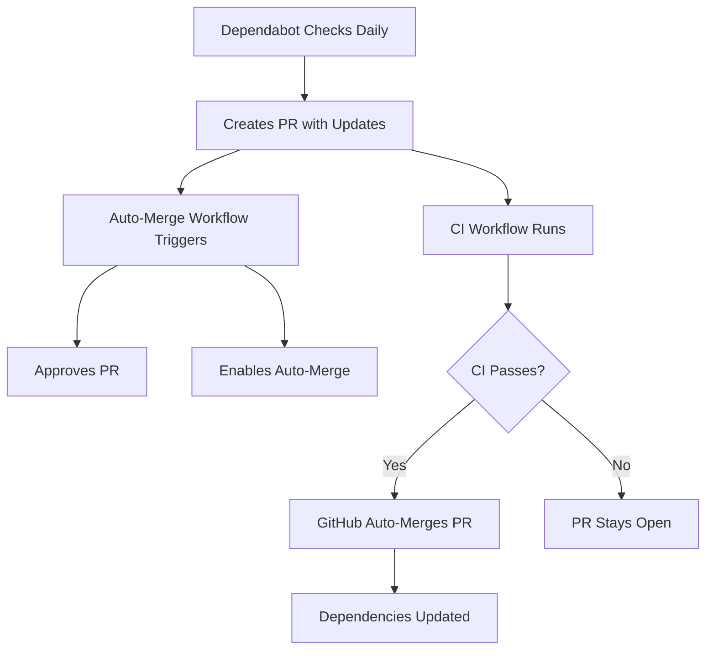

# Dependabot Auto-Merge Implementation Summary

## ✅ Implementation Complete

This document summarizes the implementation of automated Dependabot PR merging for the barkar.ch repository.

## 🎯 Objective

Enable automatic merging of Dependabot pull requests after all CI checks pass, ensuring the repository stays up-to-date with the latest dependencies without manual intervention.

## 📋 What Was Implemented

### 1. New Files Created (3)

#### `.github/workflows/dependabot-automerge.yml`
- **Purpose**: GitHub Actions workflow that automatically approves and enables auto-merge for Dependabot PRs
- **Trigger**: `pull_request_target` event (opened, synchronize, reopened)
- **Security**: Only runs for PRs from `dependabot[bot]`, uses secure token access
- **Actions**:
  1. Fetches Dependabot metadata
  2. Auto-approves the PR
  3. Enables auto-merge with squash strategy

#### `docs/DEPENDABOT_AUTOMERGE_SETUP.md`
- **Purpose**: Comprehensive setup guide and documentation
- **Contents**:
  - How the auto-merge system works
  - Required repository settings
  - Configuration file explanations
  - Update type handling (patch/minor/major)
  - Risk considerations for major updates
  - Monitoring and control instructions
  - Troubleshooting guide
  - Security considerations

#### `docs/REPOSITORY_SETTINGS_CHECKLIST.md`
- **Purpose**: Step-by-step checklist for required GitHub settings
- **Contents**:
  - Required repository settings with checkboxes
  - Branch protection configuration
  - Actions permissions setup
  - Verification steps
  - Success criteria
  - Troubleshooting common issues

### 2. Files Modified (3)

#### `.github/dependabot.yml`
- **Changes**:
  - Added dependency grouping for minor and patch updates
  - Added explanatory comments about update types
  - Documented how to disable auto-merge for major updates
- **Benefits**:
  - Reduces PR volume by grouping compatible updates
  - Major updates still create separate PRs for visibility
  - Clear documentation in the config file itself

#### `.github/README.md`
- **Changes**:
  - Added documentation for the auto-merge workflow
  - Listed workflow behavior and requirements
  - Updated "Important Notes" section with auto-merge behavior
- **Benefits**:
  - Centralizes workflow documentation
  - Makes requirements clear for maintainers

#### `README.md`
- **Changes**:
  - Added "Automated Maintenance" section
  - Documents Dependabot auto-merge system
  - Links to detailed setup guides
  - Lists all CI/CD pipelines
- **Benefits**:
  - Makes automation visible in main README
  - Helps new contributors understand the system

## 🔄 How It Works



### Step-by-Step Flow

1. **Daily Check**: Dependabot runs daily (configured schedule)
2. **PR Creation**: Dependabot creates PR(s) with dependency updates
   - Minor/Patch updates: Grouped into one PR
   - Major updates: Separate PR for each package
3. **CI Runs**: Standard CI workflow runs (build + lint)
4. **Auto-Merge Workflow**: Triggers immediately
   - Checks that PR author is `dependabot[bot]`
   - Auto-approves the PR
   - Enables auto-merge with squash strategy
5. **Automatic Merge**: GitHub merges when all required checks pass
6. **Deployment**: Deploy workflow runs on merge to main

## ⚙️ Configuration Details

### Dependabot Configuration
```yaml
# Schedule: Daily at midnight UTC
# Max concurrent PRs: 5
# Commit prefix: "chore(deps)"
# Grouping: Minor and patch updates together
# Major updates: Separate PRs
```

### Workflow Permissions
```yaml
permissions:
  contents: write        # Required to merge PRs
  pull-requests: write   # Required to approve PRs
```

### Security Features
- Uses `pull_request_target` for secure token access
- Only runs for verified Dependabot PRs
- All updates validated by CI before merge
- Uses built-in `GITHUB_TOKEN` (no additional secrets)

## 📊 Update Strategy

| Type | Example | Grouped? | Auto-Merge? | Risk |
|------|---------|----------|-------------|------|
| Patch | 1.0.0 → 1.0.1 | ✅ Yes | ✅ Yes | 🟢 Low |
| Minor | 1.0.0 → 1.1.0 | ✅ Yes | ✅ Yes | 🟡 Medium |
| Major | 1.0.0 → 2.0.0 | ❌ No | ✅ Yes* | 🔴 High |

*Major updates auto-merge only if CI passes. Consider manual review for critical dependencies.

## 🚀 Next Steps (Repository Administrator)

To activate the auto-merge system, configure these **required repository settings**:

### 1. Enable Auto-Merge
- Go to: **Settings → General → Pull Requests**
- Check: ✅ "Allow auto-merge"

### 2. Configure Branch Protection
- Go to: **Settings → Branches → Add rule for `main`**
- Enable:
  - ✅ "Require a pull request before merging"
  - ✅ "Require status checks to pass before merging"
    - Add required check: `ci`
  - ✅ "Require branches to be up to date before merging" (recommended)
  - ✅ "Require approval" (set to 1 approval - workflow provides this)
- Disable:
  - ❌ "Require review from Code Owners" (unless you want manual reviews)

### 3. Verify Workflow Permissions
- Go to: **Settings → Actions → General**
- Select: "Read and write permissions"

### 4. Test the System
Wait for the next Dependabot PR (runs daily) or trigger manually:
- Go to: **Insights → Dependency graph → Dependabot**
- Click: "Check for updates"

See `docs/REPOSITORY_SETTINGS_CHECKLIST.md` for detailed checklist.

## 📈 Benefits

✅ **Always Up-to-Date**: Dependencies updated daily automatically
✅ **Security**: Security patches applied immediately
✅ **Quality Assurance**: All updates validated by CI
✅ **Time Savings**: No manual intervention needed
✅ **Reduced PR Volume**: Minor/patch updates grouped
✅ **Transparency**: All updates visible in PR history
✅ **Rollback Ready**: Easy to revert if issues occur

## 🎛️ Control & Monitoring

### Disable Auto-Merge for Specific Update
Comment on the Dependabot PR:
```
@dependabot ignore this major version
@dependabot ignore this dependency
```

### Disable Auto-Merge Globally
- Go to: **Actions → Dependabot Auto-Merge**
- Click: **...** → **Disable workflow**

### Monitor Activity
- **Actions Tab**: View all workflow runs
- **PR History**: See merged dependency updates
- **Commit Log**: Track dependency changes

## 🔒 Security Considerations

The implementation follows GitHub security best practices:

1. **Isolated Execution**: Uses `pull_request_target` (runs in base branch context)
2. **Identity Verification**: Only runs for verified `dependabot[bot]` actor
3. **Minimal Permissions**: Only requests necessary write permissions
4. **CI Validation**: All code changes validated before merge
5. **No Secrets**: Uses built-in `GITHUB_TOKEN` only
6. **Audit Trail**: All actions logged in GitHub Actions

## 📚 Documentation

All documentation is in place:

- **Setup Guide**: `docs/DEPENDABOT_AUTOMERGE_SETUP.md` (comprehensive)
- **Settings Checklist**: `docs/REPOSITORY_SETTINGS_CHECKLIST.md` (step-by-step)
- **Workflow Docs**: `.github/README.md` (workflow descriptions)
- **Main README**: `README.md` (overview)
- **This Summary**: `IMPLEMENTATION_SUMMARY.md` (you are here)

## ✅ Validation Complete

All files have been validated:
- ✅ YAML syntax checked (all workflows and config files)
- ✅ Code review completed (feedback addressed)
- ✅ Security scan passed (CodeQL - no issues)
- ✅ Documentation comprehensive
- ✅ Best practices followed

## 🎉 Status: Ready for Merge

This PR is ready to be merged. Once merged and repository settings are configured, the auto-merge system will be fully operational.

---

**Implementation Date**: 2025-12-14  
**Implemented By**: GitHub Copilot Agent  
**Reviewed By**: Automated code review + security scan  
**Files Changed**: 6 (3 new, 3 modified)  
**Lines Added**: ~411 (including documentation)

